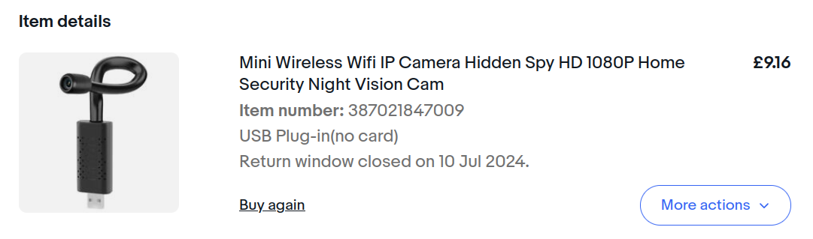

# Chinesium

This program implements the minimum necessary to output MJPEG from a family of
ultra shady / cheap cameras.

### Typical Product

Similar devices are listed on [eBay](https://www.ebay.co.uk/sch/i.html?_from=R40&_trksid=p2334524.m570.l1313&_nkw=%22iwfcam%22&_sacat=0&LH_TitleDesc=1&_odkw=%22iwfcam%22&_osacat=See-All-Categories) and
[AliExpress](https://vi.aliexpress.com/w/wholesale-%22iwfcam%22.html?spm=a2g0o.home.search.0)
as using the **IWFCam** Android app (`com.g_zhang.mywificam`). Note IWFCam may
support several camera protocols.

This device is characterized by:

* DHCP requests with the hostname `rtthread`
* Client->device UDP broadcasts on port 10104 / 255.255.255.255 for discovery
* Device->mothership UDP traffic on ports 10101, 10102
* Initial client->device communication on UDP ports 10104, 17900
* UDP payloads prefixed with `0TEG`, `1TEG`, `2TEG` signature bytes
* UDP payload references to `cloud.ismartol.com`
* DNS lookups for `cloud.ismartol.com`, `esn-cam.oss-cn-qingdao.aliyuncs.com`
* Lots of UDP traffic to Chinese IP addresses

### Requirements

* Rust compiler

### Intended Usage

1. Factory reset the device
2. Use IWFCam to connect it to a WiFi access point, preferably with no
   Internet access
3. Do not set a password in IWFCam
4. Find the MAC address from your AP and assign it a static IP address, like `10.10.1.30`
5. `cargo run 10.10.1.30`
6. `ffplay -probesize 32 -f mjpeg http://localhost:3000/cam`
7. `curl -sS http://localhost:3000/audio | sox -t ima -r 8000 - -b 16 -t wav - | ffplay -probesize 32 -f wav -` (audio is WIP)
8. Minimal player UI available on http://localhost:3000/

## Notes

* The program will fail if it is stopped and immediately restarted. Wait a few
  seconds for the device to timeout sending video to the old UDP port before
  restarting

* The camera has 640x480 resolution, not 1080p

* The UDP protocol has no support for retransmission, a single dropped packet
  is enough to cause a dropped video frame

* The device struggles to process UDP messages and seems to require duplicate
  transmissions. IWFCam retransmits some messages 5 times or more. This program
  only retransmits messages twice which may not always be sufficient.

* No support for audio or device controls (yet)

## Warning

These devices and their official app quietly speak UDP to some cloud
mothership. The protocol includes the ability to enumerate local WiFi networks,
which is enough to implement geolocation. Do not connect them to an AP with
Internet access.

### See Also

* https://github.com/fersatgit/IWFCam/ -- Delphi client
* http://www.iwfcam.com/ -- official app
* https://stackoverflow.com/questions/58670712/h264-packets-from-p2p-wifi-spy-camera -- possibly same camera model
* HDWifiCamPro (com.shix.qhipc) -- might be another app for the same camera, or same hardware with different firmware/protocol
* BVCAM -- older marketing for same apk name (com.g_zhang.mywificam) using same libZGP2PComm.so protocol library
* https://github.com/elecfreaks/ELF_vrdrone/blob/master/src/com/g_zhang/p2pComm/nvcP2PComm.java -- possible source for java parts of ZGP2Comm
* https://github.com/UND-ARC/IPCam/tree/master -- reversing project potentially for same cam
* http://hasecurity.com/HL_support_sdks.aspx -- possible SDK download
* https://apkpure.com/developer/gang.zhang?page=1 -- huge number of cam apps by IWFcam author
* https://github.com/DavidVentura/cam-reverse different implementation for different cameras

### Other Brands

The following Android apps have been published (over a decade) by the same
developer for similar or identical hardware, they're listed here to improve
Google visibility.

* Aisoul (com.g_zhang.Aisoul)
* Ambertek HD (com.g_zhang.AmbertekHD)
* babylook (com.g_zhang.babylook)
* Beenwoon (com.g_zhang.Beenwoon)
* BILLFET VISION (com.g_zhang.BILLFET_VISION)
* BVCAM (com.g_zhang.BVCAM)
* CBHCAM (com.g_zhang.CBHCAM)
* downee (com.g_zhang.downee)
* Esmar (com.g_zhang.Esmar)
* EVEREX HD (com.g_zhang.EVEREX_HD)
* eyeclub (com.g_zhang.eyeclub)
* Eyeclubs (com.g_zhang.eyeclubs)
* GTGCAM (com.g_zhang.GTGCAM)
* HDMiniCam (com.g_zhang.HDMiniCam)
* HDMiniCam Pro (com.g_zhang.HDMiniCamPro)
* HHMiniCam (com.g_zhang.HHMiniCam)
* icemoon (com.g_zhang.icemoon)
* iMiniCam (com.g_zhang.iMiniCam)
* iSmartHouse (com.g_zhang.iSmartHouse)
* KEEKOON (com.g_zhang.KEEKOON)
* KSIPC (com.g_zhang.KSIPC)
* LHFMLF (com.g_zhang.LFHMLF)
* Littleadd (com.g_zhang.Littleadd)
* LiwissCam (com.g_zhang.LiwissCam)
* MATECam (com.g_zhang.MATECam)
* MEAUOTOU (com.g_zhang.MEAUOTOU)
* MEIBOYI (com.g_zhang.MEIBOYI)
* MONUNEN (com.g_zhang.MONUEN)
* MyP2PCam / P2PLiveCam  (com.g_zhang.myp2pcam)
* P2PCAMAP (com.g_zhang.P2PCAMAP)
* Pro iCam (com.g_zhang.Pro_iCam)
* RMON (com.g_zhang.RMON)
* Sappywoon (com.g_zhang.Sappywoon)
* ShirestarCam (com.g_zhang.ShirestarCam)
* Skin Hair Tester (com.g_zhang.Skin_Hair_Tester)
* SmartIPC (com.g_zhang.SmartIPC)
* SmartLiveCam (com.g_zhang.SmartLiveCam)
* SotionCam (com.g_zhang.SOTION)
* UMANOR (com.g_zhang.UMANOR)
* VOTECOM (com.g_zhang.VOTECOM)
* WFCAM (com.g_zhang.WFCAM)
* WKK (com.g_zhang.WKK)
